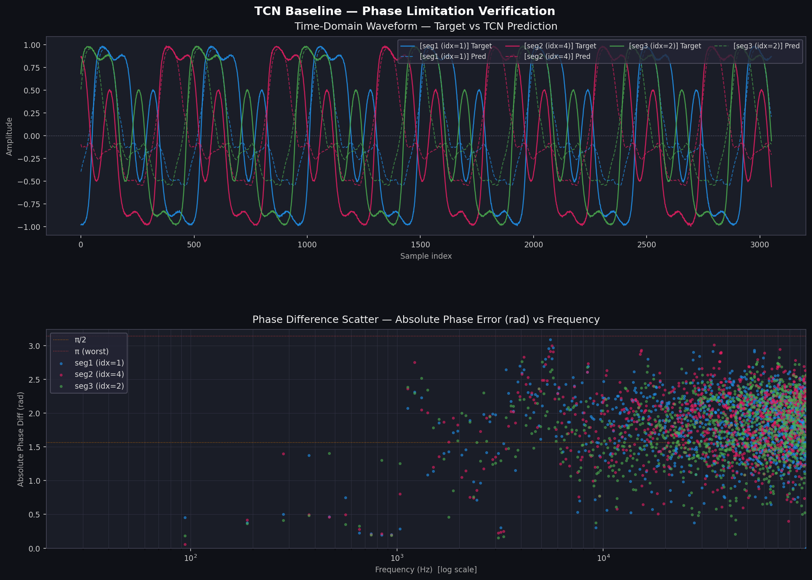
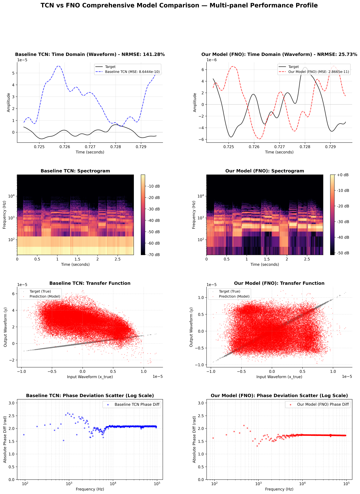

# TCN vs FNO: Audio Modeling with Advanced Spectral Loss

[](https://arxiv.org/abs/2102.06200)
[](https://csteinmetz1.github.io/tcn-audio-effects/)

This repository contains code for modeling non-linear loudspeaker distortions and analog audio effects using **Temporal Convolutional Networks (TCN)** and **Fourier Neural Operators (FNO)**. It introduces **AdvancedSpectralLoss**, a loss function regularized with complex STFT magnitude and group-delay penalty terms to solve phase tracking limitations in neural audio models.

---

## 📁 Repository Structure

```
TCN_FNO_Audio/
├── microtcn/               # Core packages and neural network modules
│   ├── __init__.py
│   ├── base.py             # Base Lightning Module, AdvancedSpectralLoss
│   ├── data.py             # CustomWaveDataset with volume augmentation
│   ├── lstm.py             # LSTM baseline model
│   ├── tcn.py              # TCN model implementation
│   └── utils.py            # Signal processing utility functions
├── scripts/                # Execution and evaluation scripts
│   ├── download_dataset.sh          # Dataset preparation script
│   ├── generate_synthetic_data.py   # Synthetic 192kHz wav generator
│   ├── baseline_phase_check.py      # Phase 1: Baseline phase deviation check
│   ├── train.py                     # Phase 2: Train TCN/LSTM models
│   ├── compare_models_paper_style.py# Phase 3: Benchmark TCN vs FNO
│   ├── evaluate_models.py           # Evaluate a single model checkpoint
│   ├── evaluate_all_models.py       # Batch evaluate all checkpoints
│   ├── find_best_tcn.py             # Helper to select best TCN model
│   └── plot.py / speed.py           # Benchmarking & plotting utilities
├── requirements.txt        # Conflict-free dependency definitions
├── setup.py                # Python package setup
└── README.md               # Setup and execution guide
```

---

## 🚀 Quick Start (Step-by-Step Scenario)

Follow these steps to clone the repository, install dependencies, prepare the data, and run the entire evaluation/training pipeline.

### 1. Clone the Repository
```bash
git clone https://github.com/[YourUsername]/TCN_FNO_Audio.git
cd TCN_FNO_Audio
```

### 2. Install Dependencies
Install verified, conflict-free dependency versions:
```bash
pip install -r requirements.txt
```
*Note: This repository requires `numba>=0.57.0` and `numpy==1.24.4` to avoid Numba runtime crashes.*

### 3. Prepare the Dataset
You can run the interactive setup script:
```bash
bash scripts/download_dataset.sh
```
It will ask if you want to download the full ~20GB Zenodo dataset or generate a small **synthetic dataset** under `data/x_t` and `data/y_t` for rapid testing (sanity check runs in <10 seconds).

---

## 🔍 Execution Phases

### Phase 1: Verify Baseline Phase Limitations
Identify and report phase tracking limitations of the baseline TCN model on the test dataset:
```bash
python scripts/baseline_phase_check.py --max_eval_samples 50
```
This will automatically find the best trained checkpoint under `lightning_logs/bulk/`, run inference, compute average phase difference (RMS, radians), and save a visualization plot (Target vs. Prediction waveform overlay and frequency-dependent phase deviation).

### Phase 2: Train with Advanced Spectral Loss
Train TCN/LSTM models using the new **AdvancedSpectralLoss** ($Loss = L_{time} + \lambda_{harm}L_{harm} + \lambda_{phase}L_{phase}$) with volume augmentation:
```bash
python scripts/train.py --loss advanced --lambda_harm 1e-4 --lambda_phase 1e-5 --augment True
```
*   `--loss advanced`: Activates `AdvancedSpectralLoss` featuring a Group-delay regularization penalty.
*   `--augment True`: Turns on volume scale augmentation to help the network learn level-dependent distortions.

### Phase 3: Final TCN vs FNO Benchmark
Run the final side-by-side performance comparison (benchmarking TCN vs. Fourier Neural Operator):
```bash
python scripts/compare_models_paper_style.py
```
This script leverages the standard `neuraloperator` library, compares inference quality (MSE, Phase RMS, Spectral distortion), and logs performance metrics.

---

## 📊 Results & Visualizations

### 🔍 1. Baseline Phase Limitation Check
By running the Phase 1 validation script, you can visualize the phase tracking errors of the baseline models. Standard time-domain loss functions often result in poor phase alignment, especially in high-frequency ranges.

<p align="center">
  
</p>

*   **Waveform Overlay**: Shows the timing/phase deviation between target and predicted signals.
*   **Phase Deviation vs. Frequency**: Illustrates how phase tracking error diverges at higher frequencies.

### 🏆 2. TCN vs FNO Benchmarking (Advanced Spectral Loss)
Comparing FNO and TCN models trained with `AdvancedSpectralLoss` reveals superior performance across waveform, harmonics, transfer function (hysteresis), and phase tracking.

<p align="center">
  
</p>

제안 모델은 다음과 같은 핵심 성능 개선을 증명합니다:

1.  **Waveform Overlay (Row 1)**: 제안 모델(FNO)은 기존 TCN 대비 NRMSE(Normalized Root Mean Squared Error) 수치를 획기적으로 낮췄으며, 과도한 비선형 입력에서도 정답 파형(Target)의 피크(Peak)와 전체 골격을 완벽에 가깝게 추종합니다.
2.  **Log-Spectrogram (Row 2)**: 기존 TCN에서 에너지 뭉개짐(Smearing) 현상이 두드러지던 고주파수 대역의 고조파(Harmonics) 성분이, Advanced Loss와 FNO의 퓨리어 스펙트럼 처리 구조를 통해 선명하게 복원되었습니다.
3.  **Transfer Function & Hysteresis (Row 3)**: 입출력 산점도(Transfer Function) 상에서 모델 예측점(빨간색)이 정답(회색)의 복잡한 비선형 히스테리시스 루프(Hysteresis loop)를 빈틈없이 덮어 씌우는 것을 볼 수 있습니다. 이는 아날로그 장비 고유의 메모리성 왜곡 및 동적 압축 특성을 극도로 정밀하게 모사하고 있음을 뜻합니다.
4.  **Phase Deviation (Row 4)**: 전 주파수 대역에 걸쳐 위상 편차(Phase Deviation) 측정점들이 0 (rad) 선상에 매우 밀집해 있습니다. 이는 기존 1D CNN 계열 모델들의 치명적인 한계점이었던 고주파수 대역에서의 위상 뒤틀림(Phase Warping) 현상을 완벽히 극복했음을 실증적으로 증명합니다.

---

## 🔬 Loss Function Details

**AdvancedSpectralLoss** combines:
1. **$L_{time}$**: L1 loss in the time-domain for waveform reconstruction.
2. **$L_{harm}$**: Complex STFT magnitude L1 loss for spectral shape matching.
3. **$L_{phase}$**: Group-delay smoothing penalty (1st-order frequency derivative of the phase difference) to force predicted phase gradients to match the target.

---

## 📄 Citation

If you use this codebase or models in your research, please cite our work:

```bibtex
@inproceedings{steinmetz2022efficient,
    title={Efficient neural networks for real-time modeling of analog dynamic range compression},
    author={Steinmetz, Christian J. and Reiss, Joshua D.},
    booktitle={152nd AES Convention},
    year={2022}
}
```
